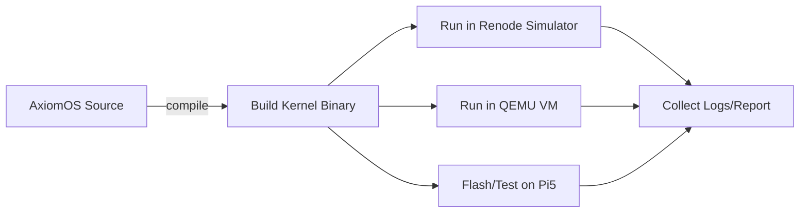

# Executive Summary

We surveyed open‐source system emulators and simulators to build “voln-sim”.  Key candidates are **QEMU**, **Renode**, **gem5**, and **OVPsim** (plus commercial simulators like Simics for context).  QEMU (GPLv2, C) is a mature ARM system emulator; its generic AArch64 “virt” machine provides an ARM CPU, GICv3 interrupt controller, ARM timers, PL011 UART, PCI/PCIe with virtio, etc.  Renode (MIT, C#) is an open-source embedded-system simulator designed for IoT/MCU development.  It supports ARM Cortex-A/M (32/64-bit) and RISC-V out of the box, models peripherals via text scripts, and emphasizes **deterministic execution** and integrated testing (CI/GitHub Actions).  Gem5 (BSD, C++/Python) can model full ARM platforms (e.g. 64-core RealView) and boot Linux, but is heavyweight and aimed at architecture research.  OVPsim by Imperas provides fast ARMv8 virtual platforms (including GICv3), but its core is proprietary (free only non-commercially).  

For **axiomOS** goals (fast edit/build/test, deterministic debug, CI, shared kernel across targets), **Renode** and **QEMU** stand out.  Renode offers a high-level deterministic simulator with rich peripheral models and CI hooks.  QEMU “virt” offers practical emulation on host hardware (including GICv3, timers, PL011 UART), enabling rapid cycles.  We recommend using Renode as the primary simulation/testing framework and QEMU as the general emulator.  Gem5 or OVPsim could be added for detailed performance modeling or special peripherals, but at higher integration cost.  The following report details each candidate’s features, a comparison table of key attributes, and an integration plan for the top options.

## Candidate Platforms

- **QEMU (System Emulator)** – Fully open-source (GPLv2).  Mature ARM (AArch64) support via the `virt` machine, including PL011 UART, ARM generic timers, GICv3/ITS, PCIe (for virtio), PSCI, etc.  Runs real OS kernels; supports snapshot (savevm), networking, block devices, etc.  Not inherently deterministic (depends on timing and randomization), but widely used.  Language: C.  Very active community and documentation.  Embedding: typically used as standalone process (can be scripted).  Example usage: Linux, Zephyr (e.g. Zephyr CI uses QEMU “virt” for ARM64).  Extensible: custom devices/models can be added in QEMU code (C).  Testing/CI: many projects already use QEMU in CI; GDB support built-in.  Hardware-in-the-loop: possible via connecting host devices, but not a core feature.  

- **Renode (Simulator)** – Open-source (MIT) framework by Antmicro for embedded systems.  Supports **ARM Cortex-A/M, RISC-V, SPARC, x86-Quark**, etc.  Peripherals and entire SoCs are defined in text scripts (.repl/.resc).  Emulates CPUs with instruction accuracy (faster than real-time) and provides **deterministic shared virtual time**.  Full debug/tracing/GDB support; emphasis on **CI/testing** (Robot Framework keywords, GitHub Actions).  Language: C# (.NET Core); comes as a standalone tool with a rich CLI and API.  Lic.: MIT.  Community: moderately active (2.7k★, 6k+ commits).  Docs: thorough on ReadTheDocs.  Embedding: typically invoked as external tool with script automation.  Example OS: Renode demos include Zephyr, FreeRTOS, Linux, and even TensorFlow Lite (Google tested with Renode).  Extensibility: pluggable model plugins (C#, Python, Verilog) for custom peripherals; can simulate sensors/actuators (IMU, LEDs, motors, etc.) via its sensor framework (though models must be provided).  Deterministic: Yes (full determinism claimed).  Snapshot: Yes (state saving/loading).  HIL: Uncommon, though Renode can interface with actual hardware via DPI co-simulation or by forwarding e.g. serial I/O.  

- **gem5 (Simulator)** – BSD-licensed computer architecture simulator.  Capable of full-system ARM simulation (RealView platform) with detailed CPU models (in-order, out-of-order, KVM).  Supports ARM32/64 and boots Linux/Android.  Focus is on accuracy (timing, memory hierarchy) and research (power modeling, multi-node).  Language: C++/Python.  Community: academic/industry (well-funded by ARM, AMD, Google).  Documentation: good on gem5.org.  Embedding: used via Python scripts (simulations are heavyweight runs).  Devices: models for caches, DRAM, no built-in robotics sensors.  Deterministic: Yes (simulator).  Snapshot: No simple snapshot (unless through checkpoint experiments).  CI: Rarely used for rapid dev (simulations take minutes to hours).  Lic.: BSD.  Example OS: Linux, FreeBSD, even legacy Solaris.  Extensibility: very flexible (SystemC/TLM integration), but steep learning curve.  HIL: No.  

- **OVPsim (Imperas)** – Commercial **simulator** core with open models (Apache 2).  Provides instruction-accurate platforms; core simulator is proprietary (free for non-commercial use).  Supports ARMv8 (Cortex-A72 etc) with GICv3, multi-core; includes many processor models (ARM, MIPS, RISC-V, ARC, etc).  High performance (hundreds of MIPS) on host.  Language: C-based API.  Model repo (OVP) has many open peripheral models.  Lic.: mixed (proprietary core, open models).  Community: limited (Imperas-driven).  Embedding: library/API usage.  Example OS: Linux boots in seconds.  Deterministic: Yes.  Snapshot: Supports checkpoint.  CI: Possible (used in research/test), but less community tooling than Renode.  Extensibility: Highly extensible via OVP APIs, but requires learning Imperas model development.  Robotics: Not a focus.  

- **Other/Commercial** – Tools like Intel® Simics (free “public release” with license) offer functional simulation with checkpointing, but are closed-source.  Virtualization stacks (KVM, Xen, Firecracker) require hardware and do not simulate missing devices.  We focus on open projects.

## Feature Comparison

| **Feature / Project**    | **QEMU (System Emu)**      | **Renode (Simulator)**          | **gem5 (Simulator)**              | **OVPsim (Imperas)**           |
|--------------------------|---------------------------|---------------------------------|------------------------------------|--------------------------------|
| **Purpose**              | Full-system emulator      | Full-system embedded simulator  | Computer/SoC simulator            | Full-system fast emulator     |
| **Architecture**         | ARMv7/ARMv8/AArch64 (x86, RISC-V, etc) | ARM Cortex-A/M (32/64), RISC-V, x86, SPARC  | ARM (32/64), x86, RISC-V, etc   | ARMv4–v8 (up to A72MPx4, GICv3), MIPS, RISC-V, ARC, etc |
| **Devices/Peripherals**  | PL011 UART, GICv2/v3/ITS, Arm Generic Timer, PL061 GPIO, RTC, PCI/PCIe (virtio-blk/net), watchdog, etc | Rich MCU/SoC peripherals (UARTs, SPI, I²C, timers, ADC, GPIO, sensors, etc.) via library of models.  Can load Verilog/C++ for new devices. | RealView DevBoard: GIC, PL011, timer, flash, DRAM controller, NIC, etc (bootable Linux).  Also ARM JTAG, caches, etc. | Generic ARM SoC components: virtual CPUs, GICv3, timers, bus interfaces, open-source peripheral models (e.g. SPI, GPIO, UART). |
| **QEMU Integration**     | —                         | **Yes** (Renode can be invoked or integrated via CLI/scripts) | — | — |
| **Deterministic Sim.**   | *No* (nondet behavior by default) | **Yes** (shared virtual time, fully deterministic) | **Yes** (simulator) | **Yes** (instruction-accurate) |
| **Snapshot/Checkpoint**  | Yes (savevm/loadvm)       | Yes (state save/restore)  | Not typical (simulate from scratch) | Yes (checkpoint support) |
| **Hardware-in-Loop**     | Limited (pass host devices) | Unspecified (focus on virtual) | No | Limited (some co-sim APIs) |
| **Testing/CI support**   | Widely used in CI (SDKs, QEMU tests).  Basic integration via scripts.  | Built-in test API, Robot keywords, GitHub Actions.  Designed for CI/automated testing. | Rarely used in CI (too slow for daily dev). | Possible but no dedicated ecosystem (Imperas provides some examples). |
| **Language / Tech**      | C, KVM acceleration       | C# (.NET Core), Python scripting | C++ core, Python config scripts | C/C++ (Imperas API) |
| **License**              | GPLv2                     | MIT (permissive)      | BSD (open)         | Core proprietary (free non-commercial); models Apache 2.0 |
| **Activity/Maint.**      | High (QEMU is very active, updated frequently) | High (active Antmicro-driven, 6k+ commits, 2.7k stars) | Active (academic community, regular releases) | Commercial (updated by Imperas, slower open model updates) |
| **Documentation**        | Extensive (wiki, manuals) | Extensive (online docs, tutorials) | Extensive (website, publications)  | Moderate (Imperas site, papers) |
| **Ease of Embedding**    | Standalone binary; can script or link libqemu (rarely) | Standalone tool with script interface; has a .NET API for embedding if needed | Used as external simulator (via Python) | As a library/API (C) |
| **Example OS/Use**       | Linux, Zephyr, Android, RTOS on ARM | Linux, Zephyr, FreeRTOS, hobby kernels, IoT firmware | Linux, FreeBSD, older OSes | Linux, Bare-metal apps |
| **Robotics Support**     | No built-in sensors (would need custom plugins) | *Can simulate sensors/actuators via its virtual environment* (e.g. IMUs, motors, LiDAR models) | No | No specific robotics models | 

> **Table:** *Comparison of candidate simulation/emulation platforms.  “Unspecific” items above are either unsupported or require custom work.*  

## Recommendations

Based on the table and axiomOS goals, we recommend **Renode** and **QEMU** as the primary components of voln-sim, with the following trade-offs:

- **Renode (Core Simulator)** – **Pros:** High-level SoC modeling, full determinism, rich debugging/CI tooling.  It naturally supports continuous testing (e.g. Robot tests) and can emulate entire boards or clusters.  Renode’s MIT license and active community are strong positives.  **Cons:** Learning curve (C#/scripts), ecosystem is .NET-based (though cross-platform).  Some specialized devices (like Pi5 RP1 power unit or proprietary sensors) may need new models.  **Effort:** *Medium*.  Steps: build Renode platform files describing our core (ARM CPU, GICv3, PL011, timer, etc.), integrate Renode test scripts into the Rust/Cargo build (for example, via its Python or CLI interface), and add the Antmicro Renode GitHub Action to CI. 

- **QEMU (`virt` Emulation)** – **Pros:** Already well-known and available on all dev machines.  Provides a fast AArch64 VM with real hardware drivers (PL011, GICv3, timer, PCIe/virtio).  QEMU can run axiomOS unmodified in its user serial console, and supports KVM for speed.  **Cons:** Not deterministic (timing differs per run), some Raspberry Pi-specific hardware (RP2040, RP1, GPU) are not emulated.  **Effort:** *Low to Medium*.  Steps: continue using QEMU for rapid local testing.  In voln-sim, provide a wrapper to launch `qemu-system-aarch64 -M virt` with the axiomOS binary.  Extend existing “cargo run-qemu” target.  Use QEMU snapshotting for quick reboot tests.  Add QEMU boots to CI (fast smoke tests).  

- **(Optional) gem5 Simulator** – **Pros:** Very accurate performance model; can simulate custom CPU configurations and buses.  **Cons:** Very slow; high setup complexity; overkill for early kernel dev.  **Effort:** *High*.  Not recommended for main workflow, but could be used in research mode if cycle-accurate modeling is ever needed.

- **(Optional) OVPsim (Imperas)** – **Pros:** High speed, supports ARMv8 up to Cortex-A72 with GICv3.  **Cons:** Core simulator is proprietary (license costs for commercial use); integration requires Imperas API; smaller community.  **Effort:** *High (and potentially expensive)*.  Likely not worth it unless commercial support is available.

- **Others:** Intel Simics or Arm FVPs are industry-grade, but closed/paid.  We exclude them due to licensing and lack of open-source.  

In summary, **Voln-sim should center on Renode and QEMU**.  Use Renode for high-speed, deterministic test simulation (catching most bugs off-hardware) and QEMU “virt” for a low-effort near-hardware emulation environment.  Gem5 and OVPsim can be mentioned as future options but are non-critical.

## Integration Plan

We outline steps to integrate the top options into Voln Labs infrastructure, with rough effort levels:

- **Repository Layout** (shared): As discussed, split code from platform.  We will create a separate `voln-sim` repo/crates alongside `axiomos`.  Example layout:
  ```
  voln-sim/
    crates/
      simulator/    # core simulation engine (time, events)
      devices/      # virtual peripheral models
      platform/     # HAL interface for different targets
      runner/       # orchestration (launch QEMU, Renode, etc)
      testing/      # Renode/Robot test scripts
    examples/
      axiomOS/
      zephyr/
      rpi5_board/
  ```
  This mirrors the plan in the previous design conversation.  AxiomOS will call into voln-sim crates for its virtualization targets.

- **QEMU Integration (Effort: Low)**: 
  - Keep existing `cargo run-rpi` or similar for real Pi5, and `cargo run-qemu` for virt.  In `voln-sim/runner`, provide a script/command that invokes QEMU with our kernel image.  
  - Define default QEMU machine (`-M virt`) and devices (using Zephyr’s example or DT files).  Possibly embed a minimal DTB or use `-machine accel=kvm,gic-version=3`.
  - Ensure our Makefile/Cargo invokes QEMU in CI as a smoke test (boot log check).
  - Because QEMU is external, we don’t embed it as a library; we simply standardize on command-line parameters and parse output.
  - **Next Steps:** Update CI to include a QEMU boot step (already done by Zephyr).  Example integration: modify CI `.github/workflows` to run `cargo run-qemu` and verify output.  No large code changes needed.

- **Renode Integration (Effort: Medium)**:
  - **Platform Description:** Write a Renode platform `.repl` file describing the Pi5 system *without* GPU/RP1 (or a generic ARM board).  Include CPU, GICv3, timer, UART, memory, etc.  Use Renode’s `stm32` or generic templates as a base.  
  - **Simulation Runner:** In `voln-sim/simulator`, implement Rust code or scripts that generate and launch Renode with our config. For example, a `voln-sim-run` command could start Renode in headless mode, load the kernel image, and hook to a virtual UART.  
  - **Testing Scripts:** Use Renode’s Robot Framework keywords to write test cases for axiomOS (e.g. “wait for UART output X”).  Put these under `voln-sim/testing`.  
  - **CI Setup:** Use the [Renode GitHub Action][46] to call these tests in CI.  E.g., a job `renode-test` that runs `antmicro/renode-test-action` with our `.resc` scripts.  This yields pass/fail in CI with logs.  
  - **Deterministic Hooks:** Leverage Renode’s state save/restore for debugging (snapshot after boot) by using the Save/Load state commands in scripts.  
  - **Next Steps:** 
    1. Prototype a simple Renode simulation: e.g. `renode` CLI loading our axiomOS ELF on a basic ARMv7 board (cortex-A7 or similar).  
    2. Build the `.resc` and `.repl` files; commit them.  
    3. Modify `voln-sim`’s `Cargo.toml` to include a `run-sim` or `test` target that invokes Renode.  
    4. Add `.github/workflows/renode.yml` to run Renode tests using the action.  
    5. Update `axiomos` code if needed to use a HAL trait for Renode vs QEMU vs Pi.  

- **gem5 Integration (Effort: High)**:  
  - Optional. Would require installing gem5 (C++ build), writing a System configuration (Python script) for our ARM target, and integrating it much like Renode.  Given gem5’s complexity, we mark this *high effort* and *deferred*.  

- **CI and Testing**:  
  - Set up a multi-stage pipeline: first run Renode-based tests (milliseconds), then QEMU boots (seconds), and optionally a hardware run (minutes) on actual Pi boards.  
  - Example GitHub Actions stages:
    ```mermaid
    graph TD
      A[Push to repo] --> B{CI Pipeline}
      B --> C[Renode Simulation Tests] 
      B --> D[QEMU VM Boot/Smoke]
      B --> E[Hardware HIL Tests (Pi5)] 
    ```
  - The pipeline gates should use the same kernel image to ensure consistency (“identify-boot on Renode/QEMU matches real boot”).  

- **API Boundaries**:  
  - Define a Rust trait `Platform` with methods like `init_uart()`, `init_timer()`, `spawn_irq()`, etc.  Implement this trait for each target (Renode, QEMU, Pi5, etc).  This ensures `axiomos` kernel code calls the same interface.  
  - E.g. in `voln-sim/platform`, we might have modules `virt` (QEMU) and `renode` implementing `Platform`.  

- **Documentation & Examples**:  
  - Provide example projects in `voln-sim/examples/axiomos/` showing how to run on Renode and QEMU.  Include documentation in `README.md` on how to start simulations.  

By separating `voln-sim` from the axiomOS repo, we create a reusable **platform layer**.  The kernel remains shared; only the platform modules swap out.  We estimate **Low** effort to ramp up QEMU support (since it already largely exists), **Medium** effort to build out the Renode integration (new files and CI scripting), and **High** effort for any gem5/OVP work. 

```mermaid
graph TB
  subgraph Host (Development Machine)
    AxiomOS["axiomOS Kernel + apps"]
    VolnSim["voln-sim Simulator Crates"]
    RenodeCLI["Renode Simulator"]
    QEMUVM["QEMU virt VM"]
    DevTools["GDB, IDE, CI"]
  end
  subgraph Hardware (Targets)
    Pi5["Raspberry Pi 5 Board"]
    Jetson["ARM Jetson Board (future)"]
  end

  AxiomOS --> |build/run| RenodeCLI
  AxiomOS --> |build/run| QEMUVM
  AxiomOS --> |build/flash| Pi5
  RenodeCLI --> |simulates| VolnSim
  QEMUVM --> |emulates| VolnSim
  VolnSim --> |common kernel| AxiomOS
  DevTools --> RenodeCLI
  DevTools --> QEMUVM
```  



Each diagram (above) illustrates the layered architecture (host vs target) and the development workflow.  By focusing on **Renode + QEMU**, Voln Labs can iterate rapidly on axiomOS: 95% of testing happens in simulation on the host, with final validation on actual hardware only when needed.  This approach reuses proven tools (QEMU, Renode) and provides a clear migration path (define Hal traits, write simulation models, and build CI). 

**Sources:** Project websites, documentation, and publications were used for this analysis.